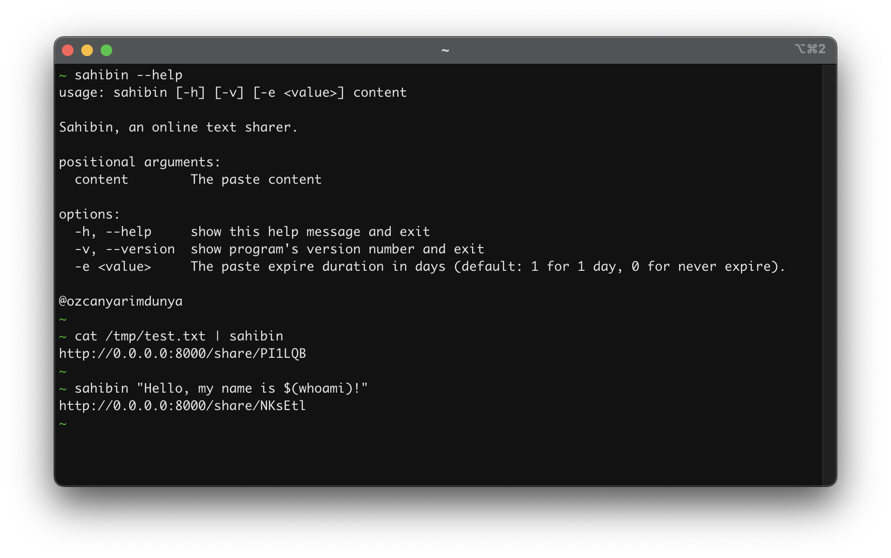

# Sahibin

Sahibin is an online platform that allows users to store and share plain text snippets or code snippets. It provides a
simple interface where users can paste their text and generate a unique URL for the paste. The generated URL can then be
shared with others for viewing or collaboration.

## Install & Run locally

### Webserver (backend)

**Installation**

```shell
$ cd webserver
$ poetry install
```

**Run**

```shell
$ cd webserver
$ uvicorn main:app --reload
```

> You may need to set up cors.

### Webui (frontend)

**Installation**

```shell
$ cd webui/
$ yarn install
```

**Run**

```shell
$ cd webserver
$ yarn run dev
```

## Deployment

### Docker

```shell
docker compose up -d --build
```

Check the [http://localhost:5000/](http://localhost:5000/).

## CLI Installation

Delete previous record if exists

```shell
docker exec sahibin-database-1 mongosh --quiet --eval "db.paste.deleteOne({key: 'stable'})" sahibin
```

Create new record

```shell
cat bin/sahibin | ./bin/sahibin -k stable
```

## Screenshots



