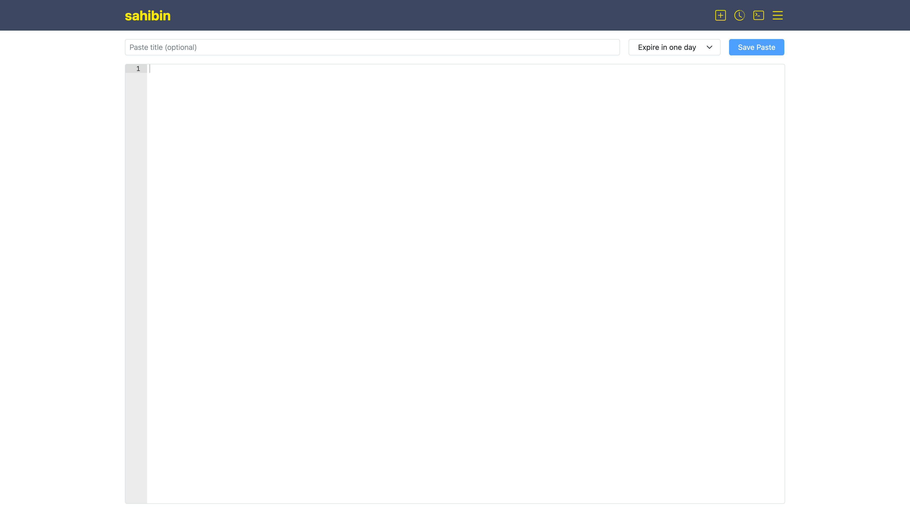
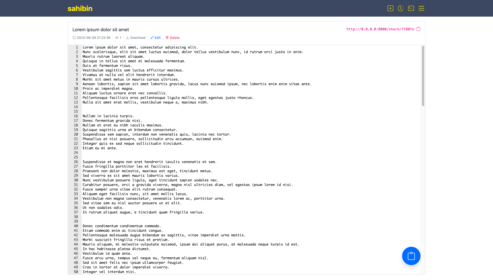

# Sahibin

Sahibin is an online platform that allows users to store and share plain text snippets or code snippets. It provides a
simple interface where users can paste their text and generate a unique URL for the paste. The generated URL can then be
shared with others for viewing or collaboration.

## Install & Run locally

### Webserver (backend)

**Installation**

```shell
$ make install-webserver
```

**Running**

```shell
$ make run-webserver
```

### Webui (frontend)

**Installation**

```shell
$ make install-webui
```

**Running**

```shell
$ make run-webui
```

## Deployment

### Docker

```shell
make run-docker
```

Check this link [http://localhost:8000/](http://localhost:8000/).

## CLI

**Installation**

```shell
$ sudo curl -k http://0.0.0.0:8000/sahibin -o /usr/local/bin/sahibin
$ sudo chmod +x /usr/local/bin/sahibin
```

**Create a new paste by providing content directly.**

```shell
$ sahibin "Hello, my name is $(whoami)!"
http://0.0.0.0:8000/share/abc123
```

**Create a new paste by providing content via stdin.**

```shell
$ cat /tmp/test.txt | sahibin
http://0.0.0.0:8000/share/xyz321
```

## Screenshots

|                                  |                                  |
|----------------------------------|----------------------------------|
| **Home Page**                    | **Share Page**                   |
|      |  |
| **History Page**                 | **Sahibin CLI**                  |
|  |  |

> @ozcanyarimdunya
